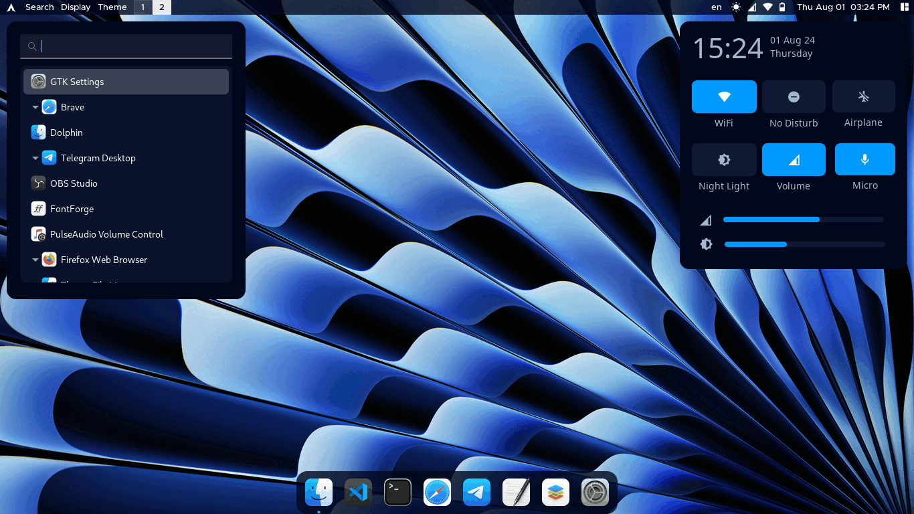

<div align="center">
    <h1>🌊 miniMinn's Hyprland Dotfiles 🌌</h1>
</div>

#### Hyprland Configuration / Dotfiles



<br>

## About 🕊️

Hello, my friends! 👋🏻

I've been running Arch Linux with Hyprland WM for almost a year for education and programming.
Initially, I started using Linux to learn Cybersecurity stuffs, but my focus got into creating an
aesthetic rice, with a lot of customization for my workflow. So, I created this repo to share my
customization dotfiles with others and also for backup 💙

Hope you like my customization! ✨

*(That Win11 wallpaper on my Linux cuztomization is to troll my friends xD)*

<br>

> [!IMPORTANT]  
> These are just personal dotfiles. I haven't fully cleaned all the code for readability and only had made for my personal use. 
> Using these dotfiles with manual configuration on a freshly installed Arch Linux with Hyprland installed is recommended.  

<br>

## Details 📄

**🐧 System**
    
| 📚 Entry | ✨ Applications |
| - | -- |
| **OS:** | Arch Linux |
| **WM:** | Hyprland |
| **Terminal:** | kitty |
| **Shell:** | zsh |
| **File manager:** | nemo |
| **Colors:** | Materia-dark (customized), WhiteSur-Light |
| **Fonts:** | Metropolis (font), JetBrainsMonoNerd Fonts & Iosevka (Icon) |
| **Keyboard layouts:** | English-US, Burmese-Pyidaungsu |
| **Authentication Agent:** | polkit-kde-agent |

<br>

**⚙️ Packages**
    
| 📚 Entry | ✨ Applications |
| - | -- |
| **Widgets:** | [eww](https://github.com/elkowar/eww.git) |
| **Wallpaper:** | [swww](https://github.com/LGFae/swww.git) & [waypaper](https://github.com/anufrievroman/waypaper.git) |
| **Bar:** | [waybar](https://github.com/Alexays/Waybar.git) |
| **Launcher:** | [wofi](https://github.com/chmouel/mounch.git) |
| **Dock:** | [nwg-dock-hyprland](https://github.com/nwg-piotr/nwg-dock-hyprland.git) |
| **Notifications:** | [swaync](https://github.com/ErikReider/SwayNotificationCenter.git) |
| **Power menu:** | [wlogout](https://github.com/ArtsyMacaw/wlogout.git) |
| **Lock screen:** | [hyprlock](https://github.com/hyprwm/hyprlock.git) |
| **Audio:** | pipewire, pamixer, pavucontrol |
| **Brightness:** | brightnessctl, light |
| **Bluetooth:** | None (my computer doesn't have a Bluetooth card TT) |
| **Screenshotting:** | grim, slurp |

<br>

**🖱️ Apps for Daily Work**

| 📚 Entry | ✨ Applications |
| - | -- |
| **Office:** | ONLYOFFICE Desktop Editors |
| **GUI Text Editor:** | Gedit |
| **IDE:** | VScode, Vim, Nano |
| **Browser:** | Brave, Firefox |
| **Photo Viewer:** | Eye of Gnome |
| **Media Player:** | Celluloid |
| **Screen Recorder:** | OBS Studio |

<br>


## Key Binding ⌨️


<details>
  <summary><b>🖥️ General</b></summary>
<br>
    
| Key Binding | Actions |
| - | -- |
| <kbd>Super</kbd> + <kbd>Q</kbd> | Close focused window |
| <kbd>Super</kbd> + <kbd>Left Mouse Button</kbd> (Drag) | Move window (Drag) |
| <kbd>Super</kbd> + <kbd>Right Mouse Button</kbd> | Resize window (Drag) |
| <kbd>Function</kbd> + <kbd>F2</kbd> | Increase volume |
| <kbd>Function</kbd> + <kbd>F3</kbd> | Decrease volume |
| <kbd>Function</kbd> + <kbd>F11</kbd> | Decrease brightness |
| <kbd>Function</kbd> + <kbd>F12</kbd> | Increase brightness |


> NOTE: My default keyboard is DELL layout, So the function keys might be 
> different with yours.

<br>

</details>

<details>
  <summary><b>📱 Launch Apps</b></summary>
<br>
  
| Key Binding | Applications |
|-| --|
| <kbd>Super</kbd> + <kbd>K</kbd> | kitty |
| <kbd>Super</kbd> + <kbd>E</kbd> | nemo |
| <kbd>Super</kbd> + <kbd>S</kbd> | wofi |
| <kbd>Super</kbd> + <kbd>L</kbd> | wlogout |
| <kbd>Super</kbd> + <kbd>I</kbd> | VScode |
| <kbd>Super</kbd> + <kbd>O</kbd> | ONLYOFFICE |
| <kbd>Super</kbd> + <kbd>P</kbd> | Brave |
| <kbd>Super</kbd> + <kbd>X</kbd> | swaync (toggle) |
| <kbd>Super</kbd> + <kbd>A</kbd> | eww actions widget (toggle) |
| <kbd>Super</kbd> + <kbd>Shift</kbd> + <kbd>A</kbd> | eww dashboard widget (toggle) |
| <kbd>Super</kbd> + <kbd>C</kbd> | eww date widget (toggle) |
| <kbd>Super</kbd> + <kbd>Alt</kbd> + <kbd>L</kbd> | Lock screen |
| <kbd>Super</kbd> + <kbd>Insert</kbd> | Screenshot (snip) |
| <kbd>Super</kbd> + <kbd>Print</kbd> | Screenshot (full) |

<br>

</details>

<br>

## How to use ❔

1. **Install required packages** for the configurations. My AUR helper is [yay](https://github.com/Jguer/yay):

   ```
   yay -Sy swww waypaper-git waybar swaync eww-git wlogout wofi nwg-dock-hyprland \
           hyprlock cava slurp grim pipewire pamixer pavucontrol brightnessctl light \
           mplayer nwg-displays nwg-look jq gojq whitesur-gtk-theme colloid-icon-theme-git \
           whitesur-icon-theme-git bibata-cursor-git neofetch htop gedit nemo code vim
   ```

2. Clone the repo and make all the scripts executable:

   ```
   git clone https://github.com/miniMinn24/Hyprland_Dotfiles.git
   cd Hyprland_Dotfiles
   find .config -type f -name "*.sh" -exec chmod +x {} \;
   ```

3. Copy the files into your ~/.config on a freshly installed Hyprland:
   
   ```
   cd .config
   cp -r * ~/.config/
   ```

<br>

> [!Note]
> I couldn't give time to write full of instructions. Some configurations, installations,
> fixing errors, you might be required to do it everything by yourself. When I have any free time,
> I'll keep learning and update it.

<br>

## To-Do List 🗹

- [x] Share my dotfiles.
- [ ] Clean the code for better readability (40% completed).
- [ ] Make a well documentation with full of instructions.
- [ ] Create automated scripts for easy installation.
- [ ] Test on multiple machines.
- [ ] Update and maintain regularly.

<br>

## Inspiration ✨

Thanks to [AlphaTechnolog](https://github.com/AlphaTechnolog/dotfiles.git)'s eww configs, I finally have my own fav widgets ;>
